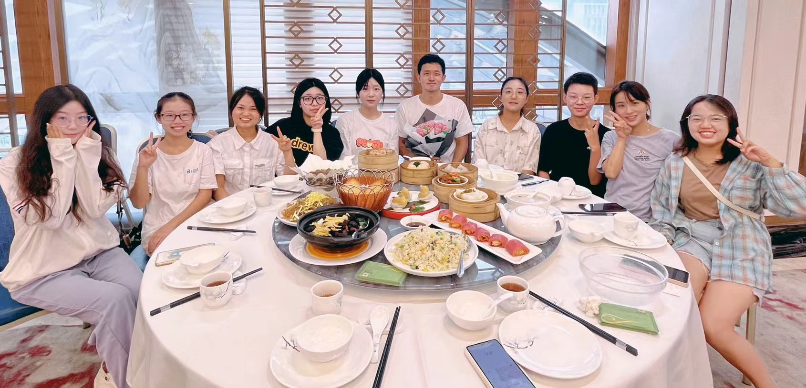

### RESEARCH INTERESTS

Our group is interested in developing innovative approaches to investigate the mechanisms underlying plant metabolism and environmental adaptation. Our goal is to understand the molecular basis of plant’s response to environmental stress (salt, heat, pollutes, etc.) and apply this knowledge to improve efficiency and ecological applicability of feature plants in ecosystem protection and environment repair. To achieve these goals, we utilize multi-omic technologies (RNA-seq, ATAC-seq, etc.) to discover the fundamental events and the basic mechanisms underlying the progression of abiotic and biotic stress responses, such as cold tolerance, plant-insect interactions, and so on. In addition, we also work on identifying and characterizing the genetic basis of plant’s circadian events, such as light and tide oscillations.

---

### ACADEMIC ENVIRONMENT

The Yang Group is located in the School of Ecology at Shenzhen Campus. Our group covers a full spectrum of research in the plant adaptation area from study design, data collection, analysis, and subsequent wet-lab follow-up. We are pround of that we offer a great and relaxed research environment (great location, graduate programs, computing facilities, etc.). We welcome new members from a wide range of disciplines to join in our group.

Our group has been actively participating in a number of collaborative researches, both internally at SYSU and externally. Our collaboraters, including Drs. Suhua Shi, Renchao Zhou, Yuan Zou and Ying Pan, are experts in plant genome evolution and environmental response. There are also numerous bright graduate and undergraduate students in the vicinity whom we enjoy working with on a daily basis.

---

### GROUP FUN

    

        

        
        

    

    
    

---

### CONTACT INFORMATION

    

            <b>Email</b>: yangych68@mail.sysu.edu.cn 
            <b>Office</b>: Medicine Building No.2 - 1503B, Sun Yat-sen University Shenzhen Campus, Gongchang Road No. 66, Shenzhen, Guangdong 518000 
            <b>GitHub</b>: <a href="https://yuchenyanggroup.github.io/">https://yuchenyanggroup.github.io/</a> 
    

