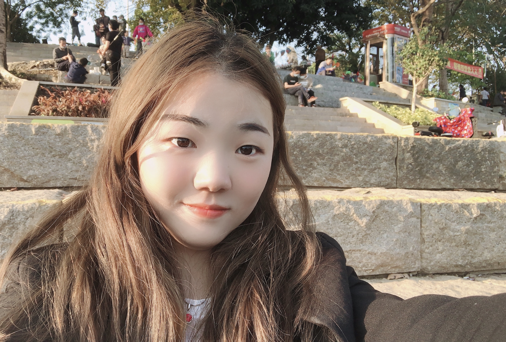
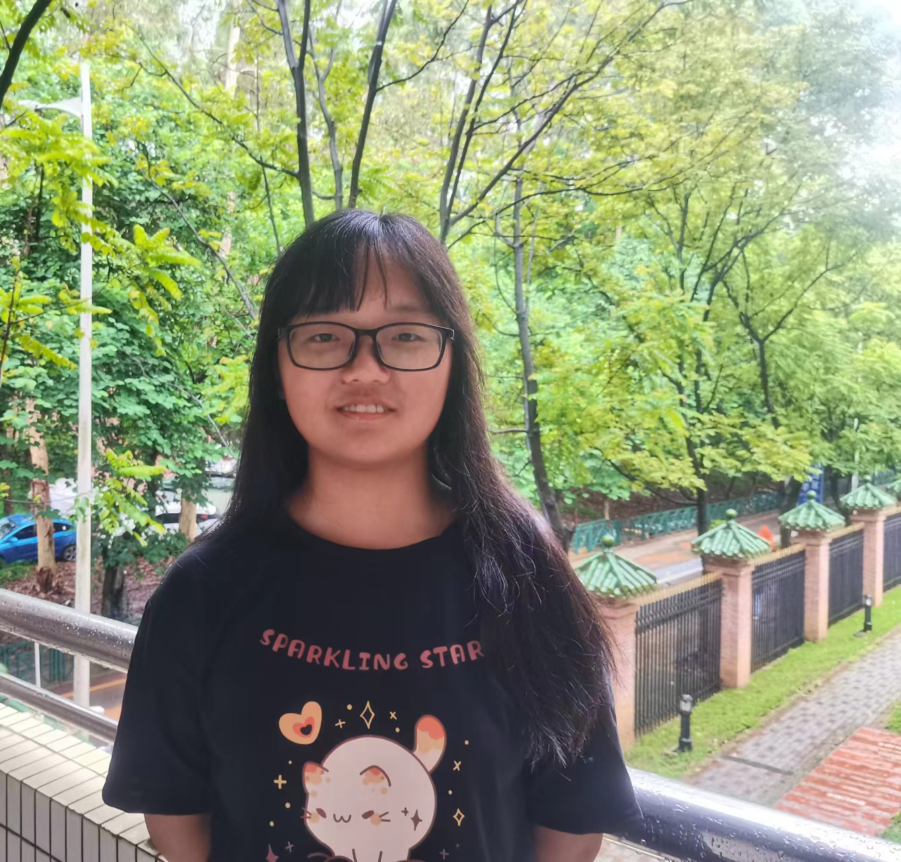

    

        

        
        

    

	Yuchen Yang, Principal Investigator  
	<a href="../assets/Curriculum Vitae_Yuchen_Yang.pdf" title="Download CV as PDF">View/Download CV</a>  

 

 
    Yuqi Liu  
    Graduate Student  
    Research topic: Transcriptional adaptation to stress conditions   

 
 

     Xinhui Xia  
     Graduate Student  
     Research topic: Post-transcriptional regulations to plant development and stress response   

 
 

    

        

        
        

    

Wenxu Ren, Forth-year undergraduate Student from School of Ecology

    

        

        
        

    

Minhong Fan, Third-year undergraduate Student from School of Ecology

    

        

        
        

    

Xiaohui Zeng, Third-year undergraduate Student from School of Ecology

    

        

        
        

    

Shan Yang, Third-year undergraduate Student from School of Ecology

    

        

        
        

    

Nuo Xu, Second-year undergraduate Student from School of Ecology

    

        

        
        

    

Panpan Zhang, Second-year undergraduate Student from School of Ecology

    

        

        
        

    

Yutong Li, Second-year undergraduate Student from School of Ecology

    

        

        
        

    

Chunxi Liang, Undergraduate Student from School of Ecology

 

## ALUMNI MEMBERS
