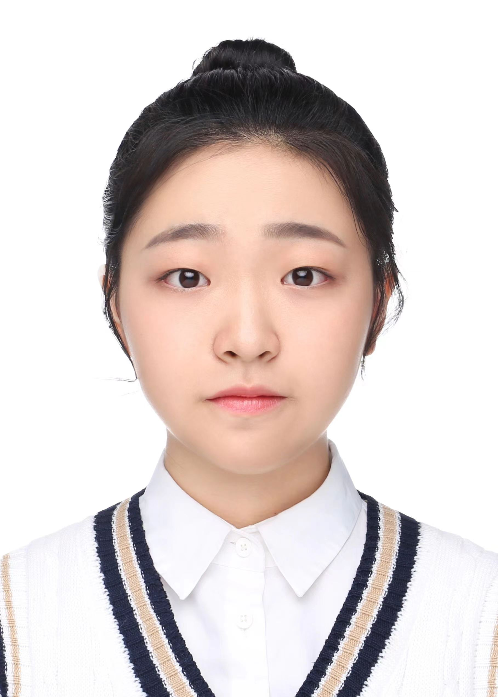

    <b>&nbsp;&nbsp;&nbsp;Yuchen Yang</b>  
    &nbsp;&nbsp;&nbsp;Principal Investigator  
    &nbsp;&nbsp;&nbsp;<a href="../assets/Curriculum Vitae_Yuchen_Yang.pdf" title="Download CV as PDF">View/Download CV</a>  
 
 
 

 
    <b>&nbsp;&nbsp;&nbsp;Yuqi Liu</b>  
    &nbsp;&nbsp;&nbsp;Graduate Student  
    <b>&nbsp;&nbsp;&nbsp;Research topic:</b> Transcriptional adaptation to stress conditions   

 
 

     <b>&nbsp;&nbsp;&nbsp;Xinhui Xia</b>  
     &nbsp;&nbsp;&nbsp;Graduate Student  
     <b>&nbsp;&nbsp;&nbsp;Research topic:</b> Post-transcriptional regulations to plant development and stress response   

 
 

     <b>&nbsp;&nbsp;&nbsp;Wen Xu</b>  
     &nbsp;&nbsp;&nbsp;Forth-year Undergraduate Student  

 
 
	    

     <b>&nbsp;&nbsp;&nbsp;Minhong Fan</b>  
     &nbsp;&nbsp;&nbsp;Third-year Undergraduate Student  

 
 

      <b>&nbsp;&nbsp;&nbsp;Xiaohui Zeng</b>  
      &nbsp;&nbsp;&nbsp;Third-year Undergraduate Student  

 
 
 

       <b>&nbsp;&nbsp;&nbsp;Shan Yang</b>  
       &nbsp;&nbsp;&nbsp;Third-year Undergraduate Student  

 
 
 

       <b>&nbsp;&nbsp;&nbsp;Nuo Xu</b>  
       &nbsp;&nbsp;&nbsp;Second-year Undergraduate Student  

 
 
 

       <b>&nbsp;&nbsp;&nbsp;Panpan Zhang</b>  
       &nbsp;&nbsp;&nbsp;Second-year Undergraduate Student  

 
 

       <b>&nbsp;&nbsp;&nbsp;Yutong Li</b>  
       &nbsp;&nbsp;&nbsp;Second-year Undergraduate Student  

 
 
 

       <b>&nbsp;&nbsp;&nbsp;Chunxi Liang</b>  
       &nbsp;&nbsp;&nbsp;Second-year Undergraduate Student  

 
 
 

## ALUMNI MEMBERS
